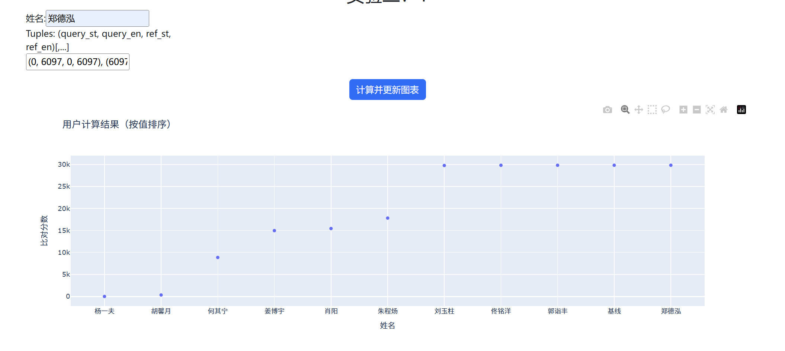
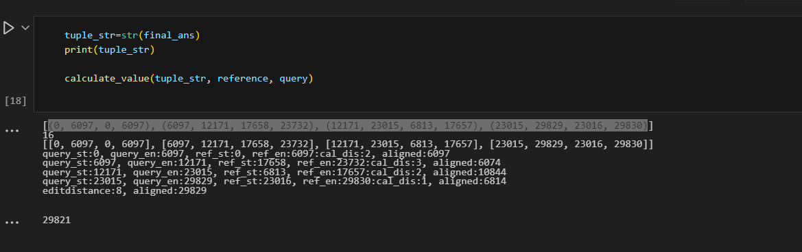
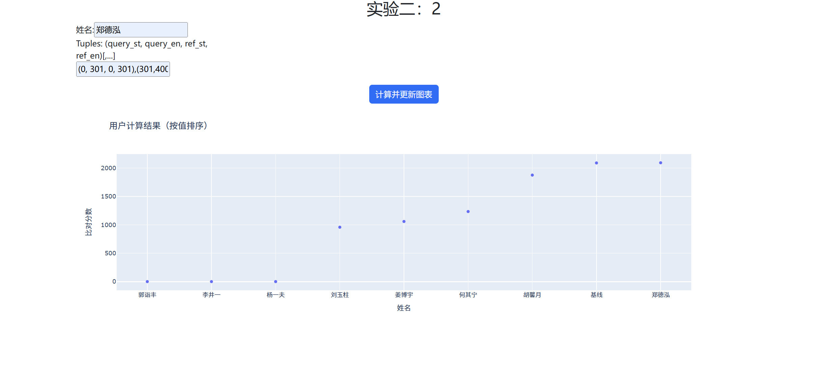
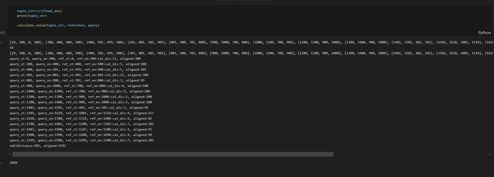
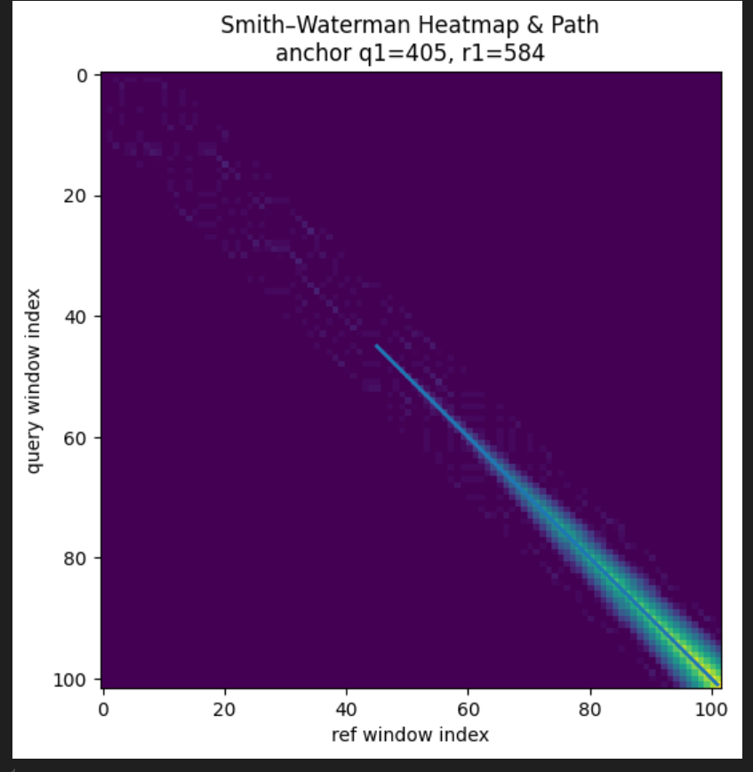

# 算法课DNA-LAB2 报告

郑德泓
23307130129

###### 1.实验结果
项目结构说明：test_qr1_submit.py对于较长的那个测试用例，test_qr2_submit.py对于较短的那个测试用例。其中的算法完全一样，只是为了助教方便检查，所以在ipynb中保留了实验结果。

测试1：（较大的串）

得分：29821
结果串：(0, 6097, 0, 6097), (6097, 12171, 17658, 23732), (12171, 23015, 6813, 17657), (23015, 29829, 23016, 29830)

测试2：（较短的串）

得分：2090
结果串：(0, 300, 0, 300), (300, 400, 400, 500), (400, 501, 499, 600), (501, 801, 601, 901), (801, 900, 701, 800), (900, 1000, 700, 800), (1000, 1200, 700, 900), (1200, 1300, 900, 1000), (1300, 1400, 900, 1000), (1402, 1501, 402, 501), (1501, 1618, 1001, 1118), (1618, 1700, 1318, 1400), (1700, 1802, 1200, 1302), (1807, 1900, 1107, 1200), (1900, 1998, 1400, 1498), (2299, 2500, 1499, 1700)

算法复杂度：近似线性时间O(m+n),其中m,n分别是reference和query的长度。  之后会给出说明。

###### 2.算法伪代码

输入：ref，que

step1:种子匹配（seed match）
容错：每11个剪辑，允许有不超过两个剪辑的错配。
一共有C(2,11)=55中不同的mask，对于一个特定的mask（比如说，这个mask只关心1,2,3,4,5,6,7,8,9,至于10,11，没匹配也无所谓）。
对于每一个mask，扫一遍ref，使用哈希表存储（字符串哈希值，起始位置），对于que同理。
然后扫一遍ref的哈希表，对于que中有相同的哈希值的起点，建立一个匹配元组（que中的小段起始位置，ref中的小段起始位置）,加入到anchors中。
为了反向匹配，用完全类似的方法，建立anchors。

step2：局部匹配（local alignment）
第一步建立的是的匹配都是长度为11的小段，这一步针对每一个种子，调用带宽限制的 Smith–Waterman 进行延伸。最多单向延伸长度为W，因为是前后延伸所以得到的匹配长度最多是2W，动态规划只做对称轴周围跨度为band的一个条带，不用全部进行动态规划。W，band都是事先定好的超参数，与数据规模无关。
具体过程如下：
Fragments = []

// 1. 为反向比对准备反向互补 Reference_RC
Reference_RC = 反向互补(ref)

// 2. 针对每一个种子，调用带宽限制的 Smith–Waterman 进行延伸
对于 (q0, r0, strand) ∈ Anchors：
如果 strand == +1：
// 正向比对：在原序列上局部延伸
(qs, qe, rs, re, sc) ←
banded_SW_simple(
ref, query,
seed_ref_pos = r0,
seed_query_pos = q0,
W, band, match, mismatch, gap
)
Fragments.添加((qs, qe, rs, re, sc, +1))

否则：
// 反向比对：在互补序列上延伸，再映回坐标
// 先把 r0 映射到 Reference_RC 上的起始位置 r0′
r0′ = (len(ref) − 1) − r0
(qs_rc, qe_rc, rs_rc, re_rc, sc) ←
banded_SW_simple(
Reference_RC, query,
seed_ref_pos = r0′,
seed_query_pos = q0,
W, band, match, mismatch, gap
)
// 映射回原序列坐标
qs = qs_rc
qe = qe_rc
// RC 序列的区间 [rs_rc, re_rc] 对应到 ref 上是
rs = (len(ref) − 1) − re_rc
re = (len(ref) − 1) − rs_rc
Fragments.添加((qs, qe, rs, re, sc, −1))

返回 Fragments

step3:筛选
对于得到的fragments_all,进行多层筛选
1.粗筛：对于长度不足30，或错配率超过0.1的fragment，丢弃。
2.第二轮筛选，对于错配超过max_err个的fragment，丢弃。
3.第三轮筛选，对于长度低于min_len的fragment，丢弃。
4.结合：对于写成多段，但实际上相连的片段，进行合并，再次得到可以很长的片段

step4：连接
对于筛选后的fragments，进行连接，得到最终的结果。
link_base方法：就是每次选最长的片段，到底了，就选下一个最长的片段的一部分，连起来。
（这个方法对于测试2可以达到2090分，但测试1比较严格，只能达到29809分，所以进行了进一步优化）
link_promote方法：对于重合的部分，遍历所有可能的划分位置，选择最优的划分点，然后进行连接。
（使用此方案，测试2可达29821分）

###### 3.算法复杂度分析

step1：虽然涉及到55个mask，但是对于每个mask，只是扫一次ref，que，所以这一步时间复杂度是O(m+n)。
且得到的anchors数量是O(m+n)。

step2：对于每一个种子，调用带宽限制的 Smith–Waterman 进行延伸，最多单向延伸长度为W。
对一个特定的种子，由于W，band都确定了，且band限制了动态规划的时候只进行一个宽度band的条带上的遍历参考这个图片，所以实际动态规划的时间复杂度是O(band*W)，是常数。进行了O(m+n)次局部的，有条带约束的动态规划，所以总体时间复杂度是O(m+n)。

step3：所有筛选都是对所有条带进行一次遍历，总体用时是O(m+n)。

step4：连接是对所有片段进行一次遍历，总体用时是O(m+n)。

综上，算法的总体时间复杂度是O(m+n)。

此外，从运行时间上也可以侧面证实这一点，测试1的长度是测试2的大约10倍，测试1的运行时间40min，测试2的时间是2min。

代码上传到：https://github.com/ddshif/DNA-lab2（其中的DNA_pj1时第一次实验的完整文件夹，其他的是第二此实验的东西）